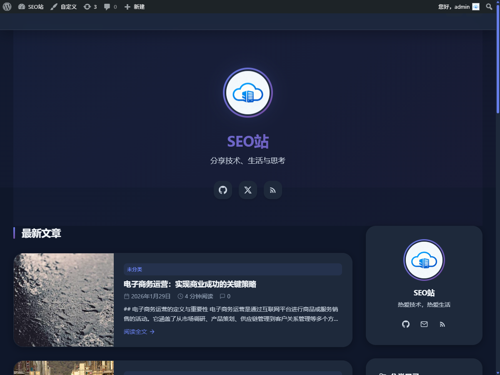

# SEO优化与AI驱动的WordPress主题 - SeoPress AI

**SeoPress AI** 是一款专为百度SEO优化不仅集成了多家国内顶尖AI大模型（DeepSeek、通义千问、文心一言、Kimi、智谱AI），还具备极简、美观、响应式的现代化设计。无任何复杂的第三方依赖，纯原生PHP/JS/CSS打造，轻量高效。

## 核心亮点 ✨

### 1. **全方位 SEO 优化**
*   **百度自动推送**：发布文章后自动推送给百度，加快收录速度。
*   **智能 Meta 标签**：自动生成 Title、Description、Keywords，无需插件。
*   **结构化数据 (Schema)**：内置 JSON-LD 结构化数据，提升搜索引擎理解能力。
*   **语义化 HTML5**：遵循最佳语义化标准，提升代码可读性。

### 2. **强大的 AI 创作助手 🤖**
内置对多家主流国产 AI 模型的原生支持，助您高效创作：
*   **DeepSeek**
*   **阿里通义千问**
*   **百度文心一言**
*   **Moonshot Kimi**
*   **智谱 AI (ChatGLM)**

支持 **AI 自动生成文章**、**内容改写**、**标题优化** 等功能，让内容生产从繁琐变得简单。

### 3. **极简且现代化的设计 🎨**
*   **完全响应式**：完美适配 PC、平板、手机等各种屏幕尺寸。
*   **深色模式**：内置舒适的夜间模式，自动跟随系统或手动切换。
*   **动态交互**：即使是静态页面也拥有流畅的微交互体验（Hover 效果、渐变文字、毛玻璃特效）。
*   **社交媒体集成**：
    *   **QQ**：支持一键唤起 QQ 聊天。
    *   **GitHub**：展示您的开源项目主页。
    *   **微信/微博**：内置分享功能。
    *   **RSS**：方便用户订阅。
    *   *(后台可直接配置各类社交账号信息)*

### 4. **高度可定制**
*   **可视化设置面板**：无需修改代码，在后台即可配置 AI API Key、SEO 选项、社交链接等。
*   **多种布局**：支持单栏、双栏布局切换。
*   **自定义页眉页脚**：灵活配置 Logo、菜单和版权信息。

## 安装与使用 🚀

1.  **下载主题**：点击 [Releases](https://github.com/sgvps-cn/seopress-ai-opensource/releases) 下载最新版 zip 包，或直接克隆本项目。
2.  **上传安装**：在 WordPress 后台 -> 外观 -> 主题 -> 添加 -> 上传主题，选择 zip 包上传并启用。
3.  **配置设置**：
    *   进入 **SeoPress AI 设置**。
    *   在 **"AI 设置"** 中配置您的 API Key。
    *   在 **"SEO 设置"** 中开启百度推送等功能。
    *   在 **"社交网络"** 中填入您的 QQ、GitHub 等链接。

## 社交链接配置示例

在后台设置中，您可以轻松管理全站的社交图标链接：

*   **QQ**: 输入 QQ 号（自动生成聊天链接）或完整推广链接。
*   **GitHub**: 输入您的 Profile URL。
*   **邮箱**: 输入联系邮箱。

*(前台效果预览：页脚及侧边栏会自动更新图标)*

## 贡献与反馈 🤝

欢迎提交 Issue 或 Pull Request 来帮助改进这个主题！

## 开源协议 📄

本项目遵循 [GPL v2 or later](LICENSE) 协议开源。
